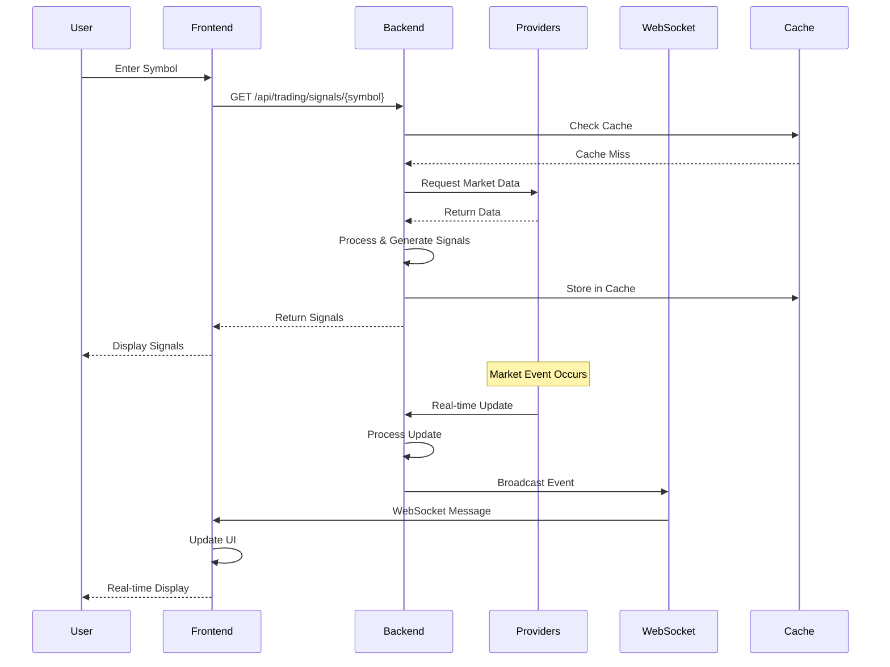
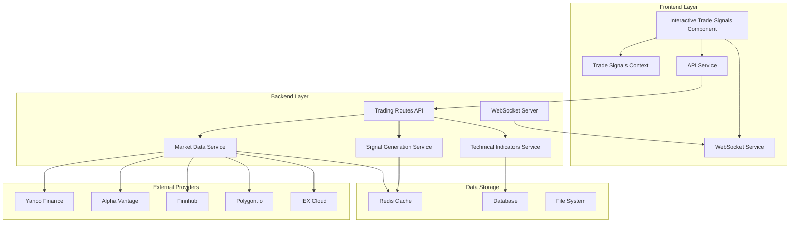
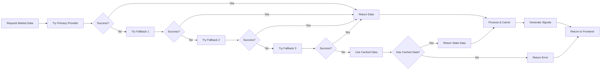
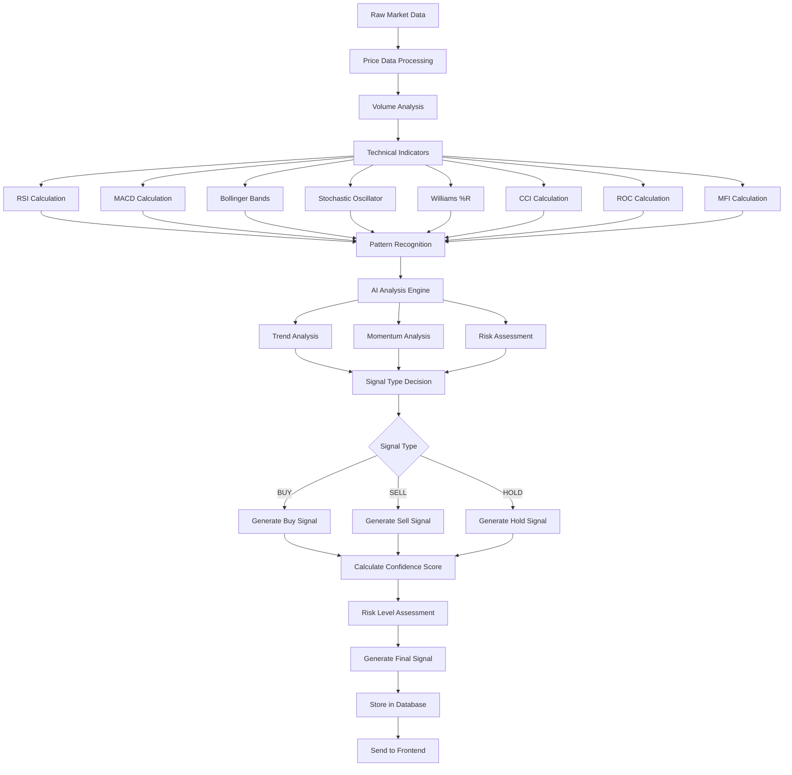
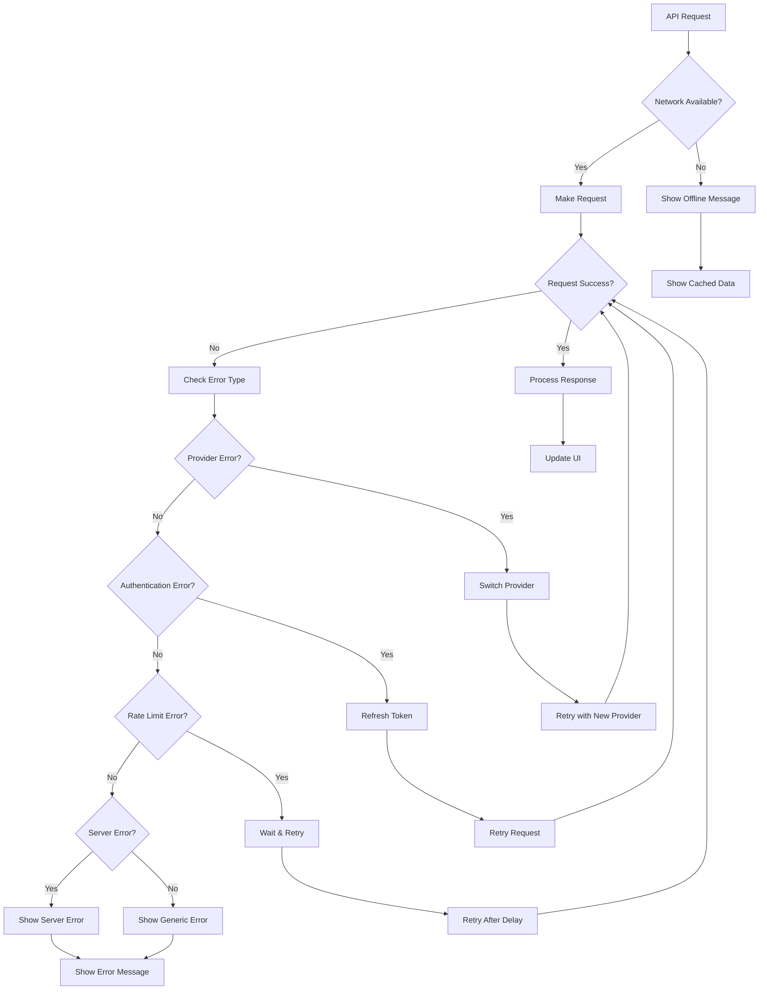
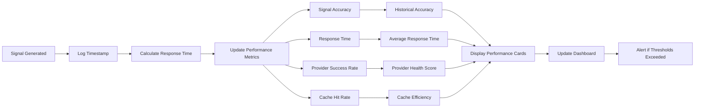
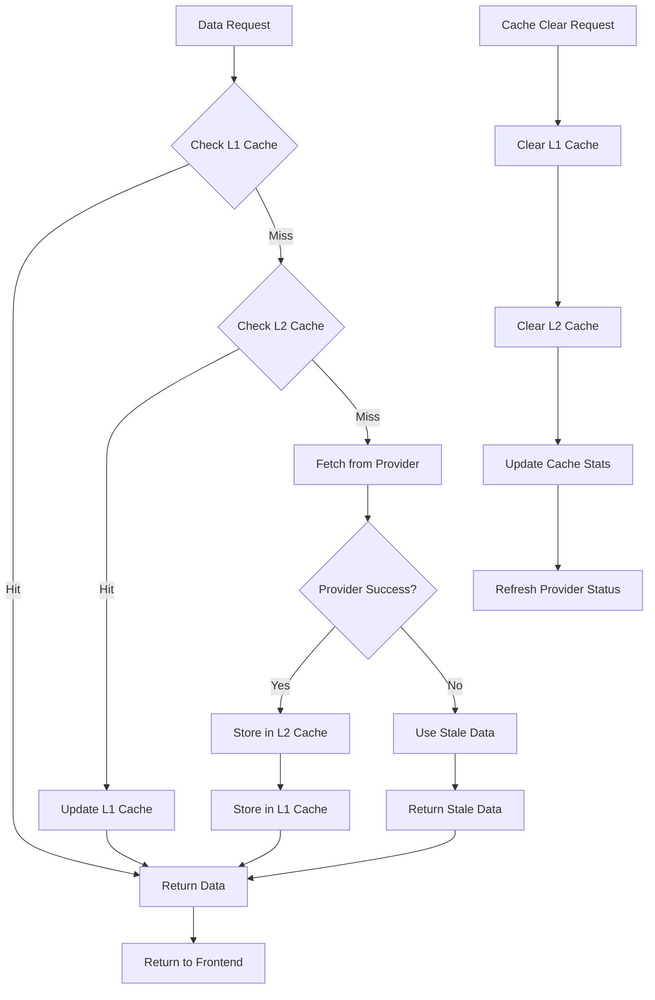

# 🔄 Interactive Signals - Visual Flowchart

## 📊 **COMPLETE DATA FLOW FLOWCHART**

```mermaid
flowchart TD
    A[User Enters Symbol] --> B{Validate Symbol}
    B -->|Valid| C[Frontend Component]
    B -->|Invalid| D[Show Error Message]
    
    C --> E[fetchSignals Function]
    E --> F[API Request: GET /api/trading/signals/{symbol}]
    
    F --> G{Backend API}
    G --> H[Check Cache]
    
    H -->|Cache Hit| I[Return Cached Data]
    H -->|Cache Miss| J[External Provider Request]
    
    J --> K{Provider Selection}
    K -->|Primary| L[Yahoo Finance]
    K -->|Fallback 1| M[Alpha Vantage]
    K -->|Fallback 2| N[Finnhub]
    K -->|Fallback 3| O[Polygon.io]
    
    L --> P{Provider Response}
    M --> P
    N --> P
    O --> P
    
    P -->|Success| Q[Process Market Data]
    P -->|Failure| R[Try Next Provider]
    R --> K
    
    Q --> S[Calculate Technical Indicators]
    S --> T[Generate AI Signals]
    T --> U[Calculate Confidence Score]
    U --> V[Store in Cache]
    V --> W[Return to Frontend]
    
    I --> W
    W --> X[Update Component State]
    X --> Y[Render Signal Display]
    
    %% Real-time Updates
    Z[Market Event] --> AA[Backend WebSocket Service]
    AA --> BB[Broadcast Update]
    BB --> CC[Frontend WebSocket Listener]
    CC --> DD[Update UI in Real-time]
    
    %% Provider Status
    EE[Provider Status Check] --> FF[Health Check API]
    FF --> GG[Update Provider Status]
    GG --> HH[Display Status Icons]
    
    %% Cache Management
    II[Cache Clear Request] --> JJ[Clear All Caches]
    JJ --> KK[Refresh Provider Status]
    KK --> LL[Update Cache Stats]
    
    %% Auto-refresh
    MM[Auto-refresh Enabled] --> NN[Set 30s Interval]
    NN --> OO[Periodic Signal Fetch]
    OO --> E
    
    %% Error Handling
    PP[Network Error] --> QQ[Show Error Message]
    QQ --> RR[Retry with Backoff]
    RR --> E
    
    PP --> SS[Provider Down] --> TT[Switch to Fallback]
    TT --> K
    
    %% Performance Monitoring
    UU[Signal Generated] --> VV[Log Performance Metrics]
    VV --> WW[Update Accuracy Stats]
    WW --> XX[Display Performance Cards]
```

## 🔄 **REAL-TIME UPDATE FLOWCHART**



## 🏗️ **SYSTEM ARCHITECTURE FLOWCHART**



## 🔄 **PROVIDER FALLBACK FLOWCHART**



## 📊 **SIGNAL GENERATION PROCESS FLOWCHART**



## 🔧 **ERROR HANDLING FLOWCHART**



## 📈 **PERFORMANCE MONITORING FLOWCHART**



## 🔄 **CACHE MANAGEMENT FLOWCHART**



---

## 📋 **FLOWCHART LEGEND**

### **Shapes Meaning:**
- **Rectangle**: Process/Function
- **Diamond**: Decision Point
- **Oval**: Start/End Point
- **Parallelogram**: Input/Output
- **Hexagon**: Database/Storage

### **Colors Meaning:**
- **Green**: Success Path
- **Red**: Error Path
- **Yellow**: Warning/Caution
- **Blue**: Information/Data
- **Purple**: External System

### **Arrows Meaning:**
- **Solid Arrow**: Normal Flow
- **Dashed Arrow**: Alternative Flow
- **Dotted Arrow**: Data Flow
- **Bold Arrow**: Critical Path

---

## 🎯 **KEY INSIGHTS FROM FLOWCHARTS**

1. **Multi-Layer Architecture**: The system uses a layered approach with clear separation of concerns
2. **Resilient Design**: Multiple fallback mechanisms ensure high availability
3. **Real-time Updates**: WebSocket integration provides live data updates
4. **Performance Optimization**: Multi-level caching reduces response times
5. **Error Handling**: Comprehensive error handling with graceful degradation
6. **Scalability**: Horizontal scaling ready with stateless design
7. **Monitoring**: Built-in performance monitoring and alerting

These flowcharts provide a complete visual understanding of how data flows through the Interactive Signals system, from user input to signal generation and real-time updates. 